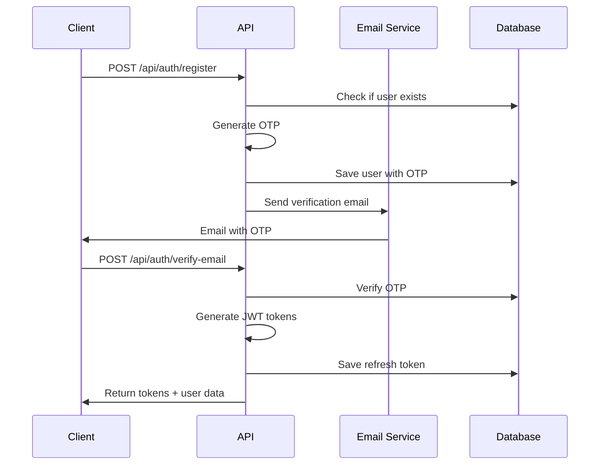
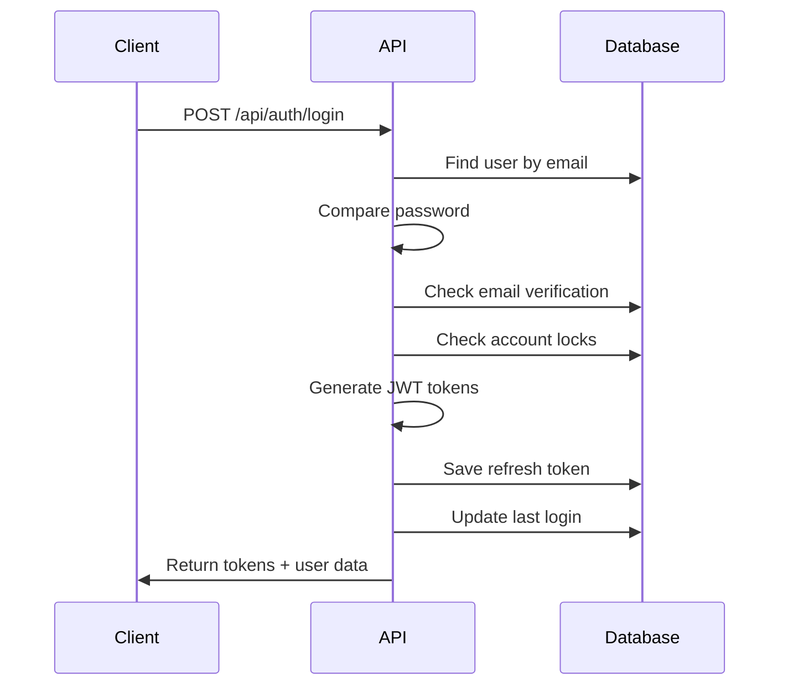
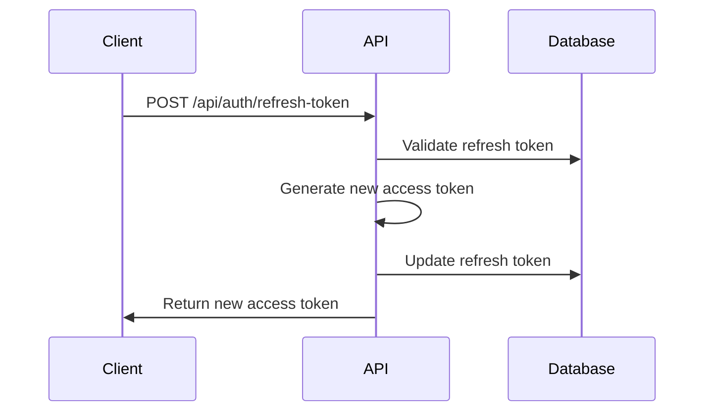

# Authentication System Documentation

This document provides comprehensive information about HeyPlay's authentication and authorization system.

## 🔐 Overview

HeyPlay implements a robust authentication system featuring:

- JWT-based authentication with refresh tokens
- Email verification via OTP
- Password reset functionality
- Session management and cleanup
- Account security features

## 🏗️ Architecture

### Token-Based Authentication

```
┌─────────────┐    ┌──────────────────┐    ┌─────────────────┐
│   Client    │    │   Backend API    │    │    Database     │
│             │    │                  │    │                 │
│ 1. Login    │───▶│ 2. Verify Creds  │───▶│ 3. Check User   │
│             │    │                  │    │                 │
│ 4. Receive  │◀───│ 3. Generate      │    │                 │
│    Tokens   │    │    JWT Tokens    │    │                 │
│             │    │                  │    │                 │
│ 5. API Call │───▶│ 6. Verify Token  │    │                 │
│ w/ Token    │    │                  │    │                 │
│             │    │ 7. Protected     │    │                 │
│ 8. Response │◀───│    Resource      │    │                 │
└─────────────┘    └──────────────────┘    └─────────────────┘
```

### Dual Token System

**Access Token**:

- Short-lived (15 minutes)
- Used for API authentication
- Contains user ID and basic info
- Stored in memory (frontend)

**Refresh Token**:

- Long-lived (7 days)
- Used to generate new access tokens
- Stored securely in database
- Can be revoked

## 🔑 Authentication Flow

### Registration & Email Verification



### Login Process



### Token Refresh



## 🛡️ Security Features

### Account Protection

1. **Login Attempt Tracking**:

   ```javascript
   // Track failed attempts
   const MAX_LOGIN_ATTEMPTS = 5;
   const LOCK_TIME = 2 * 60 * 60 * 1000; // 2 hours

   // Increment attempts on failure
   user.loginAttempts += 1;
   if (user.loginAttempts >= MAX_LOGIN_ATTEMPTS) {
     user.lockUntil = Date.now() + LOCK_TIME;
   }
   ```

2. **Account Locking**:

   ```javascript
   // Check if account is locked
   const isLocked = user.lockUntil && user.lockUntil > Date.now();
   if (isLocked) {
     return res.status(423).json({
       success: false,
       message: "Account temporarily locked",
       code: "ACCOUNT_LOCKED",
     });
   }
   ```

3. **Password Security**:

   ```javascript
   // Password hashing with bcrypt
   const saltRounds = 12;
   const hashedPassword = await bcrypt.hash(password, saltRounds);

   // Password validation
   const isValidPassword = await bcrypt.compare(password, user.password);
   ```

### Token Security

1. **JWT Configuration**:

   ```javascript
   // Access token (short-lived)
   const accessToken = jwt.sign(
     { userId: user._id, email: user.email },
     process.env.JWT_SECRET,
     { expiresIn: "15m" }
   );

   // Refresh token (long-lived)
   const refreshToken = jwt.sign(
     { userId: user._id, type: "refresh" },
     process.env.JWT_REFRESH_SECRET,
     { expiresIn: "7d" }
   );
   ```

2. **Token Blacklisting**:

   ```javascript
   // Revoke refresh token on logout
   await RefreshToken.findOneAndUpdate(
     { user: userId, token: hashedToken },
     {
       isRevoked: true,
       revokedAt: new Date(),
       revokedReason: "logout",
     }
   );
   ```

3. **Automatic Token Cleanup**:
   ```javascript
   // Clean expired tokens (runs daily)
   cron.schedule("0 0 * * *", async () => {
     await RefreshToken.deleteMany({
       $or: [
         { expiresAt: { $lt: new Date() } },
         { isRevoked: true, revokedAt: { $lt: thirtyDaysAgo } },
       ],
     });
   });
   ```

## 📧 Email Verification System

### OTP Generation

```javascript
// Generate 6-digit OTP
const generateOTP = () => {
  return crypto.randomInt(100000, 999999).toString();
};

// Set expiration (10 minutes)
const otpExpires = new Date(Date.now() + 10 * 60 * 1000);
```

### Email Templates

**Verification Email**:

```html
<!DOCTYPE html>
<html>
  <head>
    <meta charset="utf-8" />
    <title>Verify Your HeyPlay Account</title>
  </head>
  <body>
    <div
      style="max-width: 600px; margin: 0 auto; font-family: Arial, sans-serif;"
    >
      <div
        style="background: linear-gradient(135deg, #667eea 0%, #764ba2 100%); color: white; padding: 20px; text-align: center;"
      >
        <h1>🎵 HeyPlay</h1>
        <p>Sync Streaming Together</p>
      </div>

      <div style="padding: 20px; background: #f8fafc;">
        <h2>Welcome, {{username}}!</h2>
        <p>Please verify your email address using the code below:</p>

        <div
          style="background: white; padding: 20px; border-radius: 10px; text-align: center; margin: 20px 0;"
        >
          <div
            style="font-size: 32px; font-weight: bold; color: #667eea; letter-spacing: 5px;"
          >
            {{otp}}
          </div>
          <p style="color: #666; margin-top: 10px;">
            This code expires in 10 minutes
          </p>
        </div>

        <p>If you didn't create this account, please ignore this email.</p>
      </div>
    </div>
  </body>
</html>
```

### Email Service Configuration

```javascript
// Email service setup
const transporter = nodemailer.createTransporter({
  host: process.env.EMAIL_HOST,
  port: process.env.EMAIL_PORT,
  secure: false,
  auth: {
    user: process.env.EMAIL_USER,
    pass: process.env.EMAIL_PASS,
  },
  tls: {
    rejectUnauthorized: false,
  },
});

// Send verification email
const sendVerificationEmail = async (email, username, otp) => {
  const mailOptions = {
    from: `"HeyPlay" <${process.env.EMAIL_FROM_ADDRESS}>`,
    to: email,
    subject: "Verify Your HeyPlay Account",
    html: generateEmailTemplate("verification", { username, otp }),
  };

  return await transporter.sendMail(mailOptions);
};
```

## 🔄 Session Management

### Frontend Token Handling

```typescript
class AuthService {
  // Store tokens securely
  setTokens(tokens: AuthTokens): void {
    localStorage.setItem("accessToken", tokens.accessToken);
    localStorage.setItem("refreshToken", tokens.refreshToken);
  }

  // Check token expiration
  isTokenExpiringSoon(token: string): boolean {
    try {
      const payload = JSON.parse(atob(token.split(".")[1]));
      const now = Math.floor(Date.now() / 1000);
      const threshold = 5 * 60; // 5 minutes
      return payload.exp - now <= threshold;
    } catch {
      return true;
    }
  }

  // Automatic token refresh
  setupTokenRefresh(): void {
    const checkAndRefresh = async () => {
      const accessToken = this.getAccessToken();
      if (accessToken && this.isTokenExpiringSoon(accessToken)) {
        await this.refreshToken();
      }
    };

    // Check every 4 minutes
    setInterval(checkAndRefresh, 4 * 60 * 1000);
  }
}
```

### Backend Session Validation

```javascript
// Authentication middleware
const auth = async (req, res, next) => {
  try {
    const token = req.header("Authorization")?.replace("Bearer ", "");

    if (!token) {
      return res.status(401).json({
        success: false,
        message: "Access denied. No token provided.",
        code: "NO_TOKEN",
      });
    }

    const decoded = jwt.verify(token, process.env.JWT_SECRET);
    const user = await User.findById(decoded.userId);

    if (!user || !user.isEmailVerified) {
      return res.status(401).json({
        success: false,
        message: "Invalid token or user not verified",
        code: "INVALID_TOKEN",
      });
    }

    req.user = user;
    next();
  } catch (error) {
    if (error.name === "TokenExpiredError") {
      return res.status(401).json({
        success: false,
        message: "Token expired",
        code: "TOKEN_EXPIRED",
      });
    }

    res.status(400).json({
      success: false,
      message: "Invalid token",
      code: "INVALID_TOKEN",
    });
  }
};
```

## 🔐 Password Management

### Password Reset Flow

1. **Request Reset**:

   ```javascript
   // Generate reset OTP
   const resetOTP = generateOTP();
   const resetExpires = new Date(Date.now() + 15 * 60 * 1000); // 15 minutes

   user.passwordResetOTP = resetOTP;
   user.passwordResetExpires = resetExpires;
   await user.save();

   // Send reset email
   await emailService.sendPasswordResetEmail(email, username, resetOTP);
   ```

2. **Verify Reset**:

   ```javascript
   // Validate OTP and reset password
   const user = await User.findOne({
     email,
     passwordResetOTP: otp,
     passwordResetExpires: { $gt: new Date() },
   });

   if (!user) {
     return res.status(400).json({
       success: false,
       message: "Invalid or expired reset code",
       code: "INVALID_RESET_CODE",
     });
   }

   // Update password
   user.password = await bcrypt.hash(newPassword, 12);
   user.passwordResetOTP = undefined;
   user.passwordResetExpires = undefined;
   await user.save();
   ```

### Password Change

```javascript
// Change password (authenticated users)
const changePassword = async (req, res) => {
  const { currentPassword, newPassword } = req.body;
  const userId = req.user._id;

  const user = await User.findById(userId);
  const isCurrentValid = await bcrypt.compare(currentPassword, user.password);

  if (!isCurrentValid) {
    return res.status(400).json({
      success: false,
      message: "Current password is incorrect",
      code: "INVALID_CURRENT_PASSWORD",
    });
  }

  user.password = await bcrypt.hash(newPassword, 12);
  await user.save();

  // Revoke all existing refresh tokens for security
  await RefreshToken.updateMany(
    { user: userId },
    { isRevoked: true, revokedReason: "password_change" }
  );
};
```

## 🛠️ Error Handling

### Authentication Error Codes

| Code                  | Description              | HTTP Status |
| --------------------- | ------------------------ | ----------- |
| `MISSING_FIELDS`      | Required fields missing  | 400         |
| `INVALID_EMAIL`       | Email format invalid     | 400         |
| `EMAIL_EXISTS`        | Email already registered | 400         |
| `USERNAME_EXISTS`     | Username taken           | 400         |
| `INVALID_CREDENTIALS` | Wrong email/password     | 400         |
| `EMAIL_NOT_VERIFIED`  | Email needs verification | 401         |
| `ACCOUNT_LOCKED`      | Too many failed attempts | 423         |
| `INVALID_OTP`         | Wrong/expired OTP        | 400         |
| `TOKEN_EXPIRED`       | Access token expired     | 401         |
| `INVALID_TOKEN`       | Token is invalid         | 401         |
| `NO_TOKEN`            | No token provided        | 401         |

### Error Response Format

```javascript
// Standardized error response
const errorResponse = {
  success: false,
  message: "Human-readable error message",
  code: "MACHINE_READABLE_CODE",
  details: {
    /* Optional additional info */
  },
};
```

## 🔍 Security Best Practices

### Implementation Guidelines

1. **Never store passwords in plain text**
2. **Use environment variables for secrets**
3. **Implement rate limiting on auth endpoints**
4. **Log authentication events for monitoring**
5. **Validate and sanitize all inputs**
6. **Use HTTPS in production**
7. **Implement CORS properly**
8. **Regular security audits**

### Frontend Security

```typescript
// Secure token storage
class SecureStorage {
  // Use httpOnly cookies for sensitive data (if possible)
  // Implement XSS protection
  // Validate tokens before storage
  // Clear tokens on logout
}
```

### Backend Security

```javascript
// Rate limiting
const rateLimit = require("express-rate-limit");

const authLimiter = rateLimit({
  windowMs: 15 * 60 * 1000, // 15 minutes
  max: 5, // 5 attempts per window
  message: {
    success: false,
    message: "Too many authentication attempts",
    code: "RATE_LIMIT_EXCEEDED",
  },
});

app.use("/api/auth/login", authLimiter);
app.use("/api/auth/register", authLimiter);
```

## 📊 Monitoring & Analytics

### Authentication Metrics

- Login success/failure rates
- Popular registration times
- Account lock incidents
- Token refresh patterns
- Email verification rates

### Security Monitoring

```javascript
// Log authentication events
const logAuthEvent = (event, userId, details = {}) => {
  console.log(
    JSON.stringify({
      event,
      userId,
      timestamp: new Date().toISOString(),
      ip: details.ip,
      userAgent: details.userAgent,
      success: details.success,
    })
  );
};

// Usage
logAuthEvent("login_attempt", user._id, {
  ip: req.ip,
  userAgent: req.get("User-Agent"),
  success: true,
});
```

---

For implementation examples and testing, see the authentication test suites in `/backend/tests/auth.test.js`.
